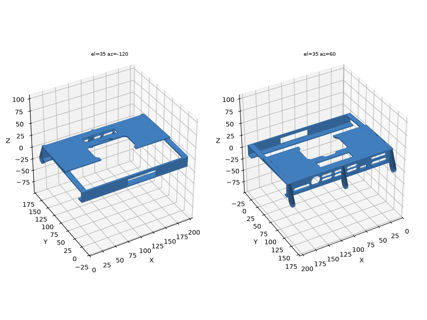
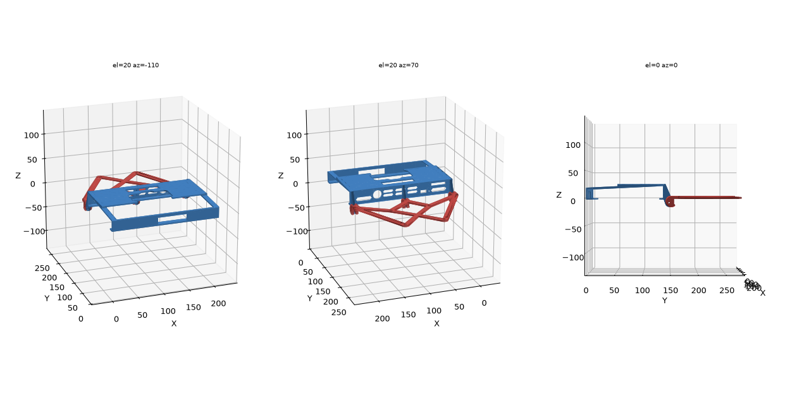

# Legion Go 2 Dual Screen

A remix of [Lenovo Legion Go Dual Screen by davolesh](https://www.thingiverse.com/thing:7291595)
for the **Lenovo Legion Go 2 (Gen 2)**. It puts the same 10.5" portable monitor on a
hinge above the handheld.




## Files to print

| File | What it is |
|---|---|
| `stl/Legion_Go_2_Case_with_Hinge.stl` | Legion Go 2 protective case with the three hinge tabs added along the top edge |
| `stl/Legion_Go_2_Monitor_Holder.stl` | davolesh's REV 2 monitor holder, with the two outer knuckle pairs moved 2.42 mm toward the centre |

`source/` holds the unmodified inputs. `build.py` regenerates both STLs from them.

## What changed vs. the Go 1 version

The original's case was built for the Go 1 tablet (210 × 131 × 20.1 mm). The Go 2
tablet is 206 × 136.7 × 22.95 mm, so this remix uses a Go 2 case and moves the
hinge onto it:

- **Case**: the hinge tabs are rebuilt on the *Legion Go 2 Protective Case* (REV4 PETG).
  - They use the original's profile: a 7.35 mm radius boss with a 4.0 mm hole, and the
    same 4.0 / 3.4 / 4.0 mm tab thicknesses.
  - The fins are taller to span the thicker Go 2 case.
  - The pivot keeps the original's offset from the case's top-front corner: 8.96 mm above
    the top edge and 6.10 mm in front of the screen lip. The monitor therefore sits in
    the same place relative to the Go 2's screen as it did on the Go 1.
- **Monitor holder**: the Go 2 is 4.84 mm narrower.
  - Each outer knuckle pair is moved 2.42 mm inward, so the hinges stay the same distance
    from the tablet's edges (and from the controllers) as on the original.
  - The four monitor mounting holes and the middle knuckles are unchanged.

### Checks run on the generated files

- Both STLs are watertight, single-body meshes.
- Every tab sits in its knuckle gap with 0.2 mm clearance per side, as in the original.
- **Hinge sweep:** the holder was rotated about the pivot against the case.
  - It is collision-free from closed (0°), through upright (180°), to about 209° of recline.
  - At 209° the knuckles reach the tabs, which act as the end stop.
  - The original Go 1 parts, run through the same test, stop at about 211°.

This hasn't been test-fitted on a physical Legion Go 2 yet. Before printing the whole
case, consider printing just the top strip to check the fit.

## Printing

- PETG is recommended, as for the Go 2 case. Use extra walls (4+) so the tabs are strong.
- Case: print with the back plate on the bed. You'll need to flip the STL, because it's
  exported in the source case's orientation. The tab fins lean less than 25° from vertical,
  so they need no supports.
- Holder: print flat, as with the original.

## Hardware

- 3 × M4 bolts, about 20 mm long, with nylon-insert lock nuts. Each joint is a
  knuckle + tab + knuckle stack about 12.4 mm thick.
  - The holder holes are 4.4 mm (clearance).
  - The case tab holes are 4.0 mm (snug). Drill them out to 4.2 mm if you want the
    hinge to turn more freely.
  - Tighten the nuts until the friction holds the monitor at the angle you want.
- Mount the monitor to the holder the same way as the original. The four holes are on
  a 76 × 76 mm pattern.

The middle tab partly covers one column of the case's top vent slots (about 3.4 mm
of them).

## Rebuilding

```sh
pip install trimesh manifold3d shapely numpy
python3 build.py
```

## Credits and licence

- Original dual-screen design: **davolesh**, [Thingiverse thing:7291595](https://www.thingiverse.com/thing:7291595),
  CC BY-SA 4.0. That design was itself a remix of
  [Lenovo Legion GO Protective case by yor42](https://www.printables.com/model/731894-lenovo-legion-go-protective-case).
- Go 2 case: [Legion Go 2 Protective Case](https://makerworld.com/en/models/2725047-legion-go-2-protective-case)
  on MakerWorld. Check that model's licence before you share or publish this remix.
- Because the original is CC BY-SA 4.0, this remix is shared under
  [CC BY-SA 4.0](https://creativecommons.org/licenses/by-sa/4.0/), as far as the Go 2
  case's own licence allows.
